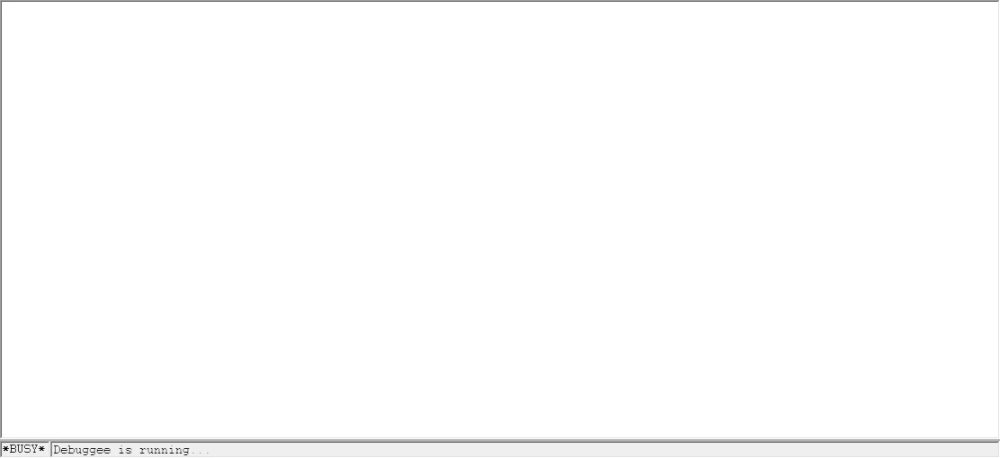

# Reflexions Sandbox 


# Summary  

1. [What is Reflexions Sandbox](#presentation)
2. [Installation procedure](#installation)
3. [When will it be released ?](#release_date)
4. [What are the system requirements ?](#requirements)
5. [Performance](#performance)
6. [Configuration](#Configuration)
7. [Log Format](#log)

## What is Reflexions Sandbox ? <a name="presentation"></a>

Reflexions is a Windows PE runtime supervision tool (EXE/DLL) which relies on an innovative approach (without hooks) to log the supervised code's behavior at the API level.  
It can be operated in two ways :  
- In a common way, where supervised activity is logged to files  
- In an interactive way, where supervised activity is output to a kernel debugger and allows break points to be set  

While not perfect, Reflexions is designed to defeat most of the 'usual' EDR evasion technics used by malicious codes as demonstrated with [BruteRatel](https://cedricg-mirror.github.io/2025/03/21/BruteRatelReflexionsAnalysis.html)  

Reflexions also comes with several handy features like :  
- Embedded function prototype from hundreds of Microsoft Win32 API 
- Attempting to dump any file created by the supervised code  
- Redirecting network communications to specified IP  
- Undetectable breakpoints on user API  
- Conditionnal breakpoints  
- Following malicious threads in remote, legitimate, processes  
- Automaticaly supervising malicious DLL dropped/loaded at runtime  
- Limiting Sleeps to a specified value
- ...

Simple GUI, all settings are read from a configuration file :  


GUI in advanced mode, more options available through the configuration file :  


Example of a breakpoint set on NtCreateThreadEx in interactive mode (bruteratel sample) :  



    
## Installation procedure  <a name="installation"></a>

A simple installation procedure can be found [here](Install.md)  
  
  
## When will it be released ?  <a name="release_date"></a>

Aiming for a first release in septembre 2025  

## What are the system requirements ?  <a name="requirements"></a>

It requires a virtualized (VMWare / VirtualBox) Microsoft Windows Guest :  

- Windows 7 x64 : 'should' be working but I do not plan to actively support this version of Windows  
- Windows 8.1 x64  
- Windows 10 x64 : current testing version  

Windows 11 guests will be supported in a later update after initial release.  

Given the deep kernel tempering operated by Reflexions, the guest OS *has* to be run in Debug mode (bcdedit /debug) to avoid the wrath of PatchGuard...  

In non-interactive mode (without a kernel debugger) :
- A modified version of kdcom.dll  
This modified version will be shipped with the installer but can also be compiled / signed manualy from my [repository](https://github.com/cedricg-mirror/KDCOM)  

In interactive mode :  
- [VirtualKD](https://github.com/4d61726b/VirtualKD-Redux) is *strongly* recommended for any live debugging (interactive) use of Reflexions
- A kernel debugger like WinDbg connected to the virtualized guest  

## Performance  <a name="performance"></a>

Reflexions' design enable generic supervision of user (ring3) code without hooks but at the cost of a kernel context switch for each API called, even for functions that would normaly not induce a syscall.  
In its default configuration, Reflexions will attempt to log any API from any DLL called by the supervised code which can lead to heavy performance overhead.  

Essentialy the overhead cost can be summerized this way :

Cost of a supervised API call = 

In non interactive mode :  
cost(API call) + **cost(Kernel Context Switch) + cost(API parameters parsing) + cost(ZwWriteFile)**  

In interactive mode :  
cost(API call) + **cost(Kernel Context Switch) + cost(API parameters parsing) + cost(Thread Synchronization) + cost(DbgPrint)**  

It is however possible to alter Reflexions' configuration to blacklist specific API or DLL, making them 'invisible' to Reflexions and removing any induced overhead  

At this point there are no optimization (like buffering) in the code, so hopefuly performances will increase a little bit later on.  

This section will be updated with some measurement before release  

## Configuration  <a name="configuration"></a>

A simple guide (work in progress) to Reflexions configuration though file or GUI is available [here](Configuration.md)  

## Log Format  <a name="log"></a>

I initialy designed Reflexions as an assistance to dynamic analysis (debugging), adding functionnalities as I encountered issues with specific samples I was reversing  
So the initial 'output' for Reflexions was my kernel debugger and this is why I chose a human readable 'log' format :

```html
[CNT] [124]
[PTP] [pid 0x728][tid 0x72c] [c:\users\user\desktop\apt10\apt10.exe]
[API] <VirtualAlloc> in [KERNEL32.DLL] 
[PAR] LPVOID lpAddress    : 0x0
[PAR] SIZE_T dwSize       : 0xe6e5
[PAR] DWORD  flProtect    : 0x40 (PAGE_EXECUTE_READWRITE)
[RET] 0x319086
```

At this point, the same format is used both for the Debugger and the log files  
A more detailed presentation of this format is available [here](#LogFormat.md) and will be updated later on  

Log formating will be reworked in a later release  

# This repository  

Until a first beta version of Reflexions is released, this repository is meant to share knownledge on malicious code targeting the Windows OS, whether they are state sponsored or cybercrime related.
The focus of my approach beeing dynamic analysis, I will be providing here logs resulting from runtime supervision of malware belonging to various APT/CyberCrime groups.

At this early stage, the logs provided have been designed to be human-readable and do not satisfy any known format that would make them easily suitable for a machine learning approach.
Log formating will be reworked in a future update of this project.

I do not plan to discuss attribution, samples analysed here are all coming from public reports from various sources that usually already provide their own insights on that topic.

# Repository

Analysed samples are stored according to the following pattern :  

[APT]/[APT_NAME]/[MALWARE_FAMILY]/[SHA256]/  
or  
[CyberCrime]/[MALWARE_FAMILY]/[SHA256]/  

Each directory contains : 
- text files logs resulting from my dynamic analysis 
- a README.md with information relative to the sample itself (source, reports, C2) as well as some of my observations / technical analysis 


